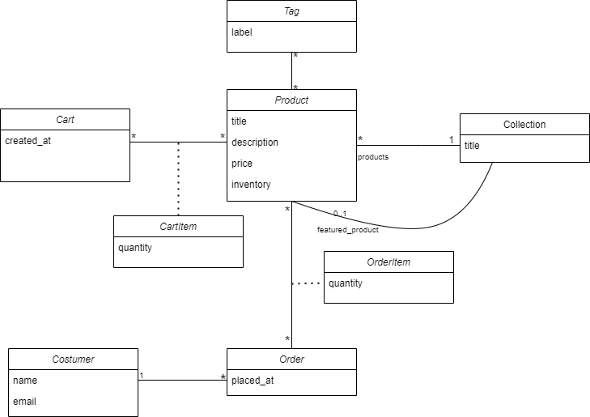

# E-Commerce application with Django
This project is my first WebApp using the Django framework. I made this following the codewithmosh Ultimate Django Series course. 

## Data Model

## Unix philosophy
To design this app I am going to be following the Unix Philosophy, which states that each app should do one thing and do it well. 
For this, the project will be divided into two smaller apps:
- **Store App**: Product, Collection, Costumer, Cart, CarItem, Order, OrderItem.
- **Tags App**: Tag, TagItem.

In this separation, each app is **Self-Contained** and provides a specific piece of functionality. Plus, it is **Zero Coupling** between this apps, so I can independently change and deploy them without affecting other apps.

This follows the idea that a good desing is one with **minimal coupling** and **high cohesion**.

